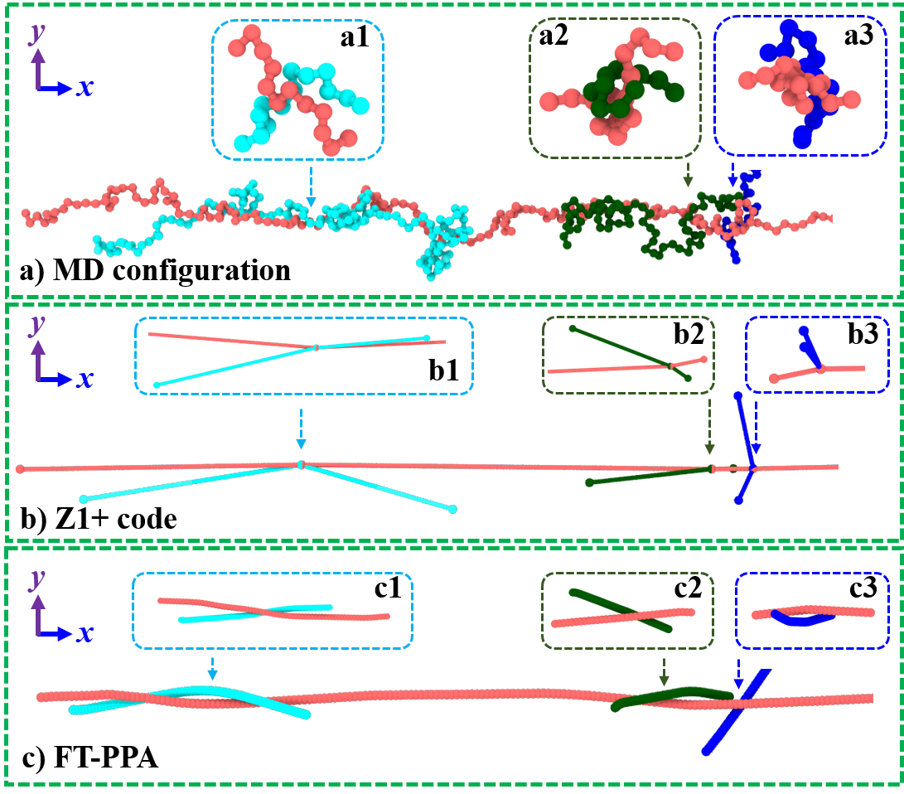

The file corresponds to MD configurations at shear rate $Wi_\text{R} = 59.3$ and strian $\gamma = 500$, for the standard Kremer–Grest model with chain length $N = 500$.
To reduce the file size, only the coordinate information is retained in these configuration files.
Here, the [Z1+ code](https://github.com/mkmat/Z1plus-code/) and FT-PPA are used to analyze the structures of a tagged chain (chain 5) and its representative neighboring chains (chains 11, 277, and 368), as shown below.

  

